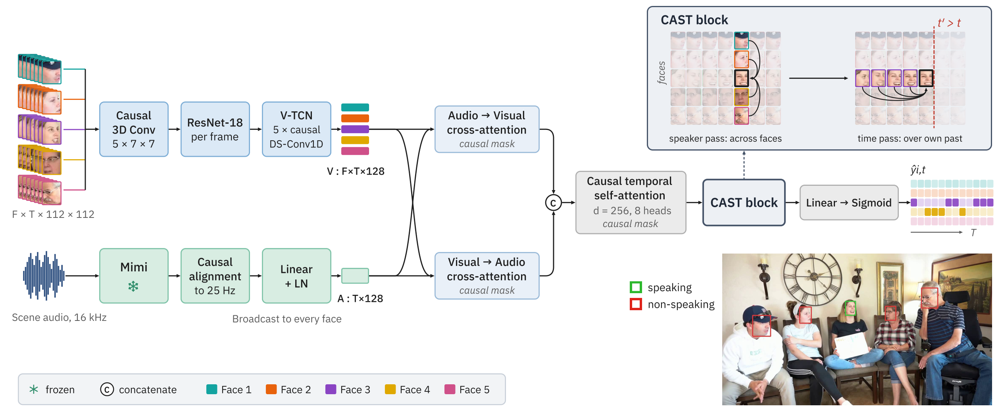

<div align="center">

# CAST-ASD

### Causal Attention over Speakers and Time for Online Active Speaker Detection

Pratham Gupta<sup>1,\*</sup> &nbsp;·&nbsp; Haotian Qi<sup>2,\*</sup> &nbsp;·&nbsp; Tushar Sandhan<sup>1</sup> &nbsp;·&nbsp; Gabriel Skantze<sup>2</sup>

<sup>1</sup>Indian Institute of Technology Kanpur &nbsp;&nbsp; <sup>2</sup>KTH Royal Institute of Technology

<sub><sup>\*</sup>Equal contribution</sub>

[](LICENSE)
[](https://www.python.org/)
[](https://lightning.ai/)

</div>

<p align="center">
  
</p>

CAST-ASD is a causal joint model for active speaker detection: for every face
in every frame, it predicts whether that person is speaking, using no future
frames. It adds one **CAST block** to a causal per-face backbone. The block has
two passes:

- a **speaker pass**, which attends across all tracked faces in the scene at the current frame;
- a **time pass**, which attends causally over each face's own past.

The result shares information across speakers with zero lookahead, and its
parameter count (1.57M per block) does not depend on the number of faces.

On MSDWild, CAST-ASD removes 32% of the competing-speaker false alarms of the
per-face detector it extends. It outperforms every causal baseline on both
validation splits, using one-tenth of the inter-speaker parameters of LoCoNet's
fixed-roster convolution.

## Results

Causal systems (zero lookahead) on the two MSDWild validation splits. Mean ±
standard deviation over three seeds. mAP<sub>c</sub> and FA<sub>c</sub> are
measured on frames where another tracked face is speaking; FA<sub>c</sub> is
read at 90% recall. DER\* uses oracle tracking and speaker identities with a
0.25 s collar.

| System | many.val mAP ↑ | mAP<sub>c</sub> ↑ | FA<sub>c</sub> ↓ | DER\* ↓ | few.val mAP ↑ |
|---|:---:|:---:|:---:|:---:|:---:|
| **CAST-ASD ×1 (Mimi)** | **90.56** ± .10 | **71.51** ± .41 | **8.61** ± .18 | **27.59** ± .23 | **96.99** ± .02 |
| LoCoNet ×3 (VGGish) | 89.15 ± .13 | 69.63 ± .81 | 11.14 ± .04 | 31.57 ± .37 | 96.71 ± .05 |
| Per-face backbone (Mimi) | 88.58 ± .16 | 69.95 ± .43 | 12.72 ± .34 | 32.17 ± .46 | 96.17 ± .05 |
| TalkNet (MFCC) | 87.15 ± .51 | 68.48 ± .96 | 13.84 ± .76 | 33.92 ± .98 | 95.27 ± .09 |
| Light-ASD (MFCC) | 85.10 ± .22 | 65.78 ± .42 | 16.73 ± .35 | 38.16 ± .21 | 94.22 ± .08 |

AVA-ActiveSpeaker validation mAP of the causal systems, scored with the
official ActivityNet evaluator:

| System | AVA val mAP ↑ |
|---|:---:|
| **CAST-ASD ×1 (Mimi)** | **91.07** ± .15 |
| LoCoNet ×3 (VGGish) | 90.19 ± .06 |
| TalkNet (MFCC) | 89.11 ± .18 |

Offline counterparts, the front-end controls, the scene-width breakdown and the
cost of causal inference are reported in the paper.

## Installation

```bash
git clone https://github.com/prathamg007/CAST-ASD.git
cd CAST-ASD
pip install -e ".[mimi,dev]"   # moshi provides the Mimi audio encoder; dev adds pytest
```

`moshi==0.2.12` pins `torch<2.10`. To keep a newer torch, install the package
with `pip install -e ".[dev]"`, then add moshi without its dependencies:
`pip install --no-deps moshi==0.2.12` and then
`pip install safetensors sentencepiece "huggingface-hub<1.0" einops`.

The Mimi, VGGish and Light-ASD/TalkNet MFCC front ends are built in.

- **Mimi** weights (`tokenizer-e351c8d8-checkpoint125.safetensors` from
  `kyutai/moshiko-pytorch-bf16`) are downloaded from the Hugging Face Hub on
  first use. The encoder runs without `torch.compile`, so Triton is not needed.
- **VGGish** AudioSet weights are downloaded from the torchvggish release through `torch.hub`.
- Recent `torchaudio` versions decode audio through `torchcodec`, so preprocessing also needs `torchcodec` and FFmpeg.

The code has been run on Linux and Windows. Run `pytest` to check the install.

## Pretrained models

All four checkpoints are CAST ×1 (one block).

| File | Config | Seed | Validation mAP | Paper (mean of 3 seeds) |
|---|---|:---:|---|---|
| `weights/msdwild_cast.ckpt` | `msdwild/cast.yaml` | 42 | few.val 97.01, many.val 90.66 | few.val 96.99, many.val 90.56 |
| `weights/msdwild_cast_offline.ckpt` | `msdwild/cast_offline.yaml` | 1 | few.val 97.55, many.val 91.77 | few.val 97.51, many.val 91.70 |
| `weights/ava_cast.ckpt` | `ava/cast.yaml` | 2 | official 91.21 | official 91.07 |
| `weights/ava_cast_offline.ckpt` | `ava/cast_offline.yaml` | 1 | official 94.31 | official 94.20 |

Evaluate a checkpoint with its matching config (data preparation below):

```bash
python train.py --config configs/msdwild/cast.yaml --test --checkpoint weights/msdwild_cast.ckpt
python train.py --config configs/ava/cast.yaml --test --checkpoint weights/ava_cast.ckpt
```

Loading fails if the config does not match the checkpoint.

- Each model was trained with seeds 42, 1 and 2, and the released file is the
  best of the three on the selection metric (few.val mAP on MSDWild, official
  mAP on AVA). The paper reports the mean over the three seeds.
- MSDWild checkpoints are from the final (12th) epoch; AVA checkpoints are the
  best epoch under early stopping.
- The frozen Mimi encoder is not stored in these files. It is rebuilt from the
  Hub and merged in when a checkpoint loads. Optimizer state is also stripped,
  so these files evaluate but cannot resume training.
- The weights are released under the same MIT license as the code. They were
  trained on AVA-ActiveSpeaker and MSDWild, so use them in line with those
  datasets' terms (MSDWild is distributed under its own license agreement).

## Data preparation

### MSDWild

Download [MSDWild](https://github.com/X-LANCE/MSDWILD) and arrange it as:

```text
data/msdwild/videos/<video>.mp4 + <video>.csv     # videos and face boxes
data/msdwild/rttms/{all,few.train,few.val,many.val}.rttm
```

Then pack each split:

```bash
for split in few.train few.val many.val; do
  python -m cast_asd.preprocess.msdwild --input data/msdwild/videos \
      --rttm data/msdwild/rttms/all.rttm --split-rttm data/msdwild/rttms/$split.rttm \
      --split $split --output data/msdwild/packed/$split
done
```

Each video is cut into 30 s scenes. Every face track in a scene shares the
scene's audio.

### AVA-ActiveSpeaker

Start from the standard AVA-ActiveSpeaker layout, as prepared by TalkNet:
`csv/`, `clips_videos/` and `clips_audios/`. Then pack each split:

```bash
python -m cast_asd.preprocess.ava --input data/ava --output data/ava/packed/train --split train
python -m cast_asd.preprocess.ava --input data/ava --output data/ava/packed/val   --split val
```

Clips keep their native frame rate. The audio is never resampled in time;
audio features are causally aligned to the video frames inside the model.

The paths above are what `configs/*/_base.yaml` expect. Edit those files if
your data lives elsewhere. Data and output paths in a config are resolved
from the directory you run `train.py` in (the repository root in the examples);
only `_base_` is resolved relative to the config file itself.

## Training and evaluation

```bash
python train.py --config configs/msdwild/cast.yaml --seed 42
python train.py --config configs/ava/cast.yaml --seed 42
```

Options:

- `--audio {mimi,vggish,talknet}` swaps the audio front end.
- `--run-name` sets the output directory under `checkpoint_dir`. The default is
  `<config>-seed<N>`, with a `-test` suffix for `--test` runs, so different
  configs and seeds never overwrite each other.
- `--devices` sets the number of GPUs (default 1). The batch samplers are not
  distributed, so multi-GPU training is not supported.
- `--test --checkpoint <file>` evaluates a checkpoint instead of training.
- `--wandb` enables logging to Weights & Biases.

Without a GPU, training and evaluation fall back from 16-bit mixed precision to
32-bit.

**MSDWild** training:

- runs a fixed 12-epoch cosine schedule and reports the final epoch;
- evaluates on `few.val` and `many.val` side by side;
- logs mAP, mAP_c (AP on frames where another tracked face speaks), FA_c (competing false alarms at 90% recall) and DER\* (oracle diarization, 0.25 s collar);
- logs the same metrics by the number of tracked faces in the scene.

**AVA** training uses step decay with early stopping. It is scored with the
ActivityNet evaluator (`val/mAP_official`), vendored in
`cast_asd/tasks/ava_official/` in the version distributed with TalkNet-ASD.
That version reads the CSV header, uses `float` in place of the removed
`np.float`, and returns the mAP; the scoring itself is unchanged.

## Reproducing the paper

Every config extends its dataset's `_base.yaml` and changes only what its name
says. Each row below corresponds to a result reported in the paper.

| Paper | MSDWild config | Notes |
|---|---|---|
| CAST-ASD ×1 (Mimi) | `cast.yaml`, `cast_offline.yaml` | main model |
| CAST-ASD ×2/×3/×6 | `cast_d2.yaml`, `cast_d3.yaml`, `cast_d3_offline.yaml`, `cast_d6.yaml` | depth |
| Pass order | `cast_timeface.yaml` | time pass first |
| CAST on VGGish | `cast.yaml --audio vggish`, `cast_d3.yaml --audio vggish` | Table 3 |
| Per-face backbone (Mimi) | `perface.yaml` | no scene mixer |
| LoCoNet ×3 (VGGish) | `loconet.yaml`, `loconet_offline.yaml` | published model, causalised |
| LoCoNet ×1/×6 | `loconet_d1.yaml`, `loconet_d6.yaml` | depth |
| LoCoNet on Mimi, s = 3/4/5 | `loconet_d1.yaml --audio mimi`, `loconet.yaml --audio mimi`, `loconet_s4_mimi.yaml`, `loconet_s5_mimi.yaml` | Table 3 |
| TalkNet (MFCC) | `talknet.yaml`, `talknet_offline.yaml` | |
| Light-ASD (MFCC) | `lightasd.yaml`, `lightasd_offline.yaml` | |

On AVA, `configs/ava/` holds `cast.yaml`, `cast_offline.yaml`, `loconet.yaml`
and `talknet.yaml`.

The `*_offline` configs set `asd.causal: false`. That one switch removes every
causal constraint at once: the attention masks, the left-only convolution
padding and the audio alignment. Weight shapes are unchanged, so each offline
model differs from its causal twin only in what it may read.

## Causality tests

`tests/test_causality.py` and `tests/test_scene_causality.py` check zero
lookahead by perturbation. They change every input after frame `t` and assert
that outputs up to `t` are bit-identical. The checks cover every audio front
end, the backbone, both scene mixers and Light-ASD.

Run the full suite with `pytest`.

## Citation

Please cite our paper if you use this code or the model weights.

```bibtex
@misc{gupta2026castasd,
  title  = {{CAST-ASD}: Causal Attention over Speakers and Time for Online Active Speaker Detection},
  author = {Gupta, Pratham and Qi, Haotian and Sandhan, Tushar and Skantze, Gabriel},
  year   = {2026}
}
```

## Acknowledgements

The per-face backbone builds on [TalkNet-ASD](https://github.com/TaoRuijie/TalkNet-ASD).
The LoCoNet and Light-ASD baselines are reimplemented from
[LoCoNet](https://github.com/SJTUwxz/LoCoNet_ASD) and
[Light-ASD](https://github.com/Junhua-Liao/Light-ASD), the audio encoder is
[Mimi](https://github.com/kyutai-labs/moshi) from Kyutai, and AVA scoring uses the
[ActivityNet](https://github.com/activitynet/ActivityNet) evaluator. We thank the
authors of these projects and of the [MSDWild](https://github.com/X-LANCE/MSDWILD)
and [AVA-ActiveSpeaker](https://research.google.com/ava/) datasets.

## License

The code and the released weights are under the MIT license (see `LICENSE`).
